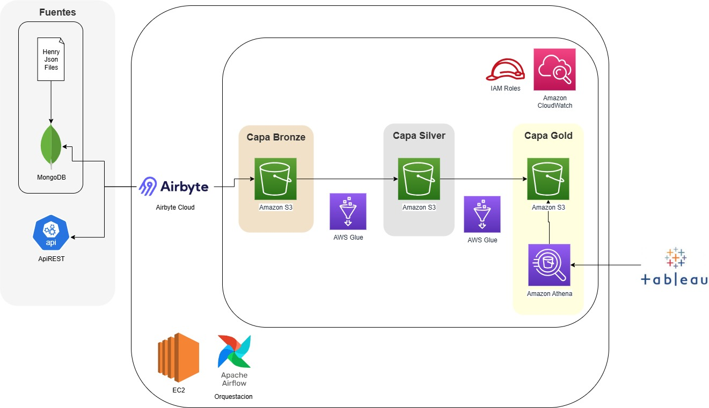

# Documento tecnico: Arquitectura del Pipeline ETLT sobre AWS

Este proyecto implementa un pipeline de datos escalable utilizando herramientas modernas de ingesta, procesamiento, almacenamiento y orquestación en la nube. A continuación se describe la arquitectura propuesta y los beneficios de cada componente.

## Arquitectura General

## Diagrama de Arquitectura

### Fuentes de Datos
- **MongoDB**: Base de datos NoSQL con datos proporcionados por el curso.
- **API pública de Fórmula 1**: Fuente externa con datos.

### Middleware
- **Airbyte**: Herramienta de ingesta que consume datos desde MongoDB y la API, enviándolos en formato Parquet a un bucket S3.

### Almacenamiento en AWS

El almacenamiento en AWS S3 está organizado en tres buckets que representan las capas del Data Lake:

- **pi-m3-bronze**: Contiene los datos crudos en formato Parquet, provenientes directamente de las fuentes.
- **pi-m3-silver**: Almacena los datos transformados por AWS Glue, listos para análisis intermedio.
- **pi-m3-gold**: Contiene los datos finales optimizados para consumo por herramientas de BI como Tableau.

### Procesamiento
- **AWS Glue con Spark**: Procesa y optimiza los datos desde Bronze, escribiéndolos en otro bucket S3 como Capa Silver.

### Consulta y Visualización
- **AWS Athena**: Crea tablas sobre los datos en S3 y permite consultas SQL.
- **Tableau**: Herramienta de visualización que consume los datasets desde Athena.

### Orquestación
- **Apache Airflow**: Desplegado en un contenedor Docker sobre una instancia EC2. Orquesta la ejecución de los DAGs:
  - DAG 1: Ingesta desde API.
  - DAG 2: Ingesta desde MongoDB.

## Beneficios del Stack Tecnológico

- **Airbyte**: Fácil configuración de conectores, soporte para múltiples fuentes.
- **S3**: Almacenamiento escalable y económico.
- **Glue + Spark**: Procesamiento distribuido, optimización automática.
- **Athena**: Consultas serverless sin necesidad de infraestructura adicional.
- **Airflow**: Orquestación flexible, manejo de dependencias y errores.

## Propósito del Repositorio Local

Este repositorio contiene únicamente la configuración y pruebas locales de los DAGs de Airflow. Estas pruebas permiten validar la lógica de orquestación antes de desplegar el entorno completo en una instancia EC2 en AWS.

## Mejora con AWS Lake Formation

Para mejorar la arquitectura actual, se podria usar **AWS Lake Formation** como capa de gobernanza y seguridad:

- Gestión centralizada de permisos a nivel de tabla, columna y fila.
- Registro automático en Glue Data Catalog.
- Auditoría de accesos y trazabilidad.
- Definición de zonas de datos (raw, trusted, curated).
- Integración directa con Athena y Tableau con control de acceso.

Esta mejora permitiría una administración más segura, escalable y trazable del Data Lake.

## Detalles de los DAGs de Airflow

El proyecto incluye DAGs de Airflow que orquestan la ejecución completa del pipeline ETLT. A continuación se describen las tareas incluidas en el DAG `dag_mongodb`:

### DAG: `dag_mongodb`

- **trigger_airbyte_sync**: Tarea que realiza una sincronización manual con Airbyte. Utiliza credenciales almacenadas en variables de entorno para obtener un token de autenticación y luego dispara una conexión específica definida en Airbyte para extraer datos desde MongoDB o una API pública.

- **run_glue_job_bronze**: Ejecuta un Glue Job llamado `bronze_to_silver` que transforma los datos crudos almacenados en la capa Bronze del bucket S3 y los escribe en la capa Silver. Este job utiliza Spark sobre Glue con configuración de 2 workers tipo G.1X.

- **run_glue_job_silver**: Ejecuta el Glue Job `silver_to_gold`, que toma los datos transformados de la capa Silver y los optimiza para análisis final en la capa Gold. También se ejecuta con Spark sobre Glue y configuración similar.

## DAG adicional: `dag_api`

Este DAG complementa el pipeline realizando la ingesta de datos desde una API pública. A continuación se describen sus tareas:

### DAG: `dag_api`

- **trigger_airbyte_sync**: Tarea que inicia la sincronización con Airbyte utilizando una conexión específica para la API pública. Se autentica mediante token y dispara el job de ingesta hacia S3.

- **run_glue_job_bronze**: Ejecuta el Glue Job `bronze_to_silver_api`, que transforma los datos crudos provenientes de la API y los escribe en la capa Silver del Data Lake.

- **run_glue_job_silver**: Ejecuta el Glue Job `silver_to_gold_api`, que toma los datos transformados y los optimiza para análisis final en la capa Gold.

Este DAG permite integrar datos externos al pipeline, manteniendo la misma estructura de procesamiento y almacenamiento que el DAG de MongoDB.
